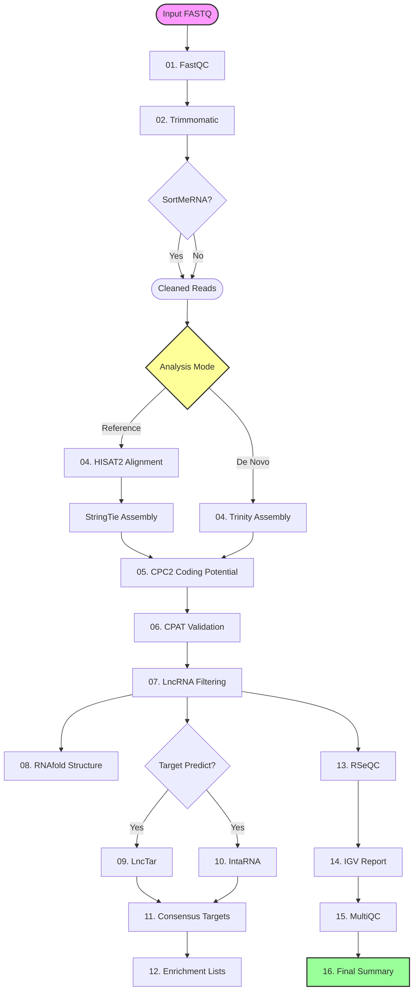

# REGIS v2.0 - RNA-seq Guided Identification System


**REGIS (RNA-seq Guided Identification System)** is a comprehensive, modular bioinformatics pipeline designed for the high-confidence identification and functional characterization of **Long Non-Coding RNAs (lncRNAs)**. 

Re-engineered in **Go**, REGIS v1.0.1 brings a premium **Terminal User Interface (TUI)**, robust process management, and a seamless developer experience, while maintaining rigorous scientific accuracy.


[](https://git.io/typing-svg)

---

## 🚀 Key Features

*   **🖥️ Modern TUI**: Real-time progress tracking, system resource monitoring (CPU/RAM), and beautiful visualizations using `Bubble Tea`.
*   **🧬 Flexible Analysis**: Supports both **De Novo** (Trinity) and **Reference-based** (HISAT2/StringTie) assembly modes.
*   **🛡️ Robust Quality Control**: Integrated FastQC, Trimmomatic, and **SortMeRNA** (rRNA filtering) for clean data.
*   **🎯 High-Confidence Filtering**: 
    *   Multi-step coding potential assessment using **CPC2** and **CPAT**.
    *   Strict length (>200nt) and probability thresholds.
    *   Classification of **Novel Intergenic**, **Antisense**, and **Intronic** lncRNAs against reference annotations.
*   **🔗 Functional Prediction**:
    *   **RNAfold** for secondary structure prediction.
    *   **LncTar** and **IntaRNA** for lncRNA-mRNA interaction discovery.
    *   **Consensus Analysis** to identify high-confidence targets confirmed by multiple tools.
*   **🧪 Enrichment Ready**: Automatically generates gene lists (Background, Associated, Targets) formatted for enrichment analysis (e.g., getENRICH).
*   **📊 Comprehensive Reporting**: Generates interactive **MultiQC** reports, **IGV** HTML genome browser reports, and a final pipeline summary in JSON/Markdown/HTML.

---

## 🛠️ Pipeline Workflow



---

## 📦 Installation

### Prerequisites
REGIS relies on several external bioinformatics tools. We recommend using **Conda** to manage these dependencies.

1.  **Install Go (v1.21+)**: [Download Go](https://go.dev/dl/)
2.  **External Tools**:
    ```bash
    # Create a conda environment with all dependencies
    conda create -n regis -c bioconda -c conda-forge \
        fastqc trimmomatic sortmerna hisat2 trinity stringtie \
        samtools gffcompare seqkit bedtools subread \
        python=3.10 rna-seqc multiqc igv-reports
    
    # Activate environment
    conda activate regis
    ```
    *Note: CPC2, CPAT, LncTar, and IntaRNA may require manual installation or specific bioconda recipes.*

### Build from Source
```bash
# Clone the repository
git clone https://github.com/BioinformaticsOnLine/regis.git
cd regis/regis-go

# Build the binary
go build -o regis .

# Verify installation
./regis --help
```

---

## 💻 Usage

REGIS offers two modes of operation: **Interactive TUI** and **CLI Arguments**.

### 1. Interactive Mode 🌟
Simply run `regis` without any arguments to launch the TUI wizard. It will guide you through setting up your analysis.
```bash
./regis
```

### 2. CLI Mode ⚡
For automated workflows or power users, use command-line flags.

#### Basic Reference-Based Analysis
```bash
./regis -t paired \
        -m reference \
        -f1 R1.fastq.gz -f2 R2.fastq.gz \
        -r genome.fa \
        -g annotation.gtf \
        -o results_dir
```

#### Detailed CLI Flags
| Flag | Description | Required? |
|------|-------------|-----------|
| **-t** | Data type: `single` or `paired` | ✅ |
| **-m** | Method: `denovo` or `reference` | ✅ |
| **-f1** | Input file 1 (Forward/Single) | ✅ |
| **-f2** | Input file 2 (Reverse, for paired) | Conditional |
| **-r** | Reference Genome FASTA | Conditional |
| **-g** | Reference Annotation GTF/GFF | Conditional |
| **-o** | Output Directory | ✅ |
| **-c** | CPU Cores (default: auto-detect) | ❌ |
| **--sortmerna** | Enable rRNA filtering (Highly Recommended) | ❌ |
| **--lnctar** | Enable LncTar predictions | ❌ |
| **--intarna** | Enable IntaRNA predictions | ❌ |
| **--skip-cpat** | Skip CPAT validation (use CPC2 only) | ❌ |

---

## 📂 Output Structure

REGIS organizes results into a structured directory tree:

```text
results_dir/
├── 01_fastqc/             # FastQC reports
├── 02_trimmed/            # Cleaned FASTQ files
├── 03_sortmerna/          # rRNA filtered reads (if enabled)
├── 04_alignment/          # HISAT2 BAM files / Trinity Assembly
├── 05_assembly/           # StringTie GTF assemblies
├── 06_cpc2/               # Coding potential results
├── 07_validation/         # CPAT results & Consensus list
├── 08_lncrna_analysis/    # Final LncRNA Characterization
│   ├── filtered/          # Final lncRNA sequences (FASTA/GTF)
│   ├── novel_lncrnas/     # Specifically novel, antisense, intronic transcripts
│   └── expression/        # FeatureCounts expression matrices
├── 11_target_prediction/  # LncTar & IntaRNA results
├── 12_enrichment/         # Gene lists for enrichment (Background vs Targets)
├── 15_multiqc/            # Aggregate QC report
└── 16_pipeline_report/    # FINAL SUMMARY (HTML, JSON, Markdown)
```

---

## 👥 Authors & Acknowledgements

**REGIS Team**:
*   **Dr. Jitendra Narayan** (Principal Investigator) - University of Namur / CSIR-IGIB
*   **Dr. Stefano Tiozzo** (Principal Investigator) - CNRS-Sorbonne University
*   **Pranjal Pruthi** (Lead Developer & Researcher) - CSIR-IGIB

**Funding**:
*   Supported by **The Rockefeller Foundation** and **CSIR-IGIB**.

---

## 📜 Citation & License

### Citing REGIS
If you use REGIS in your research, please cite:
> *REGIS: A Comprehensive RNA-seq Guided Identification System for lncRNA Discovery. [Paper Link]*

### Third-Party Citations
REGIS wraps several academic tools. Please also cite:
*   **LncTar**: *Li, J., et al. (2015). LncTar: a tool for predicting the RNA targets of long noncoding RNAs. Briefings in Bioinformatics.*
    *   *Note: LncTar is included/used under a license restricted to non-commercial genomic research.*
*   **CPC2, CPAT, IntaRNA, FASTQC, HISAT2, StringTie, Trinity**: Please cite their respective original publications.

### License
REGIS is licensed under the **MIT License**. See `LICENSE` for details.
